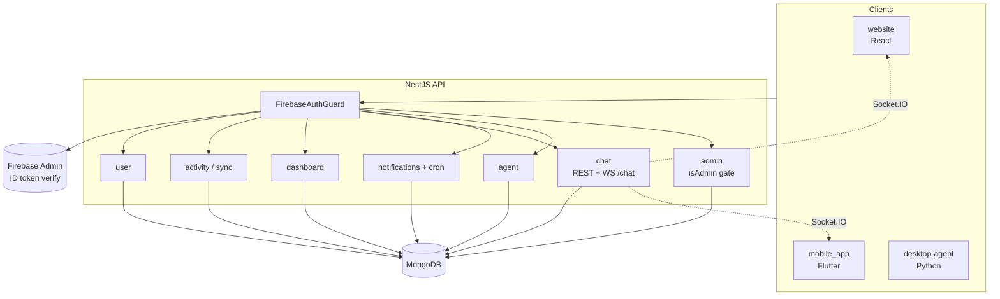

# Zenno Backend API

Zenno Backend is the core API service for the Zenno platform. It powers:

- authenticated user profile management
- activity ingestion and analytics calculations
- dashboard metrics and insights endpoints
- real-time chat (REST + WebSocket)
- notification preferences, unread states, and push delivery
- agent preferences and nudge-related stats

The service is built with NestJS and MongoDB, using Firebase ID token verification for authentication.

## Product Overview

Zenno is a developer productivity and wellbeing platform. This backend acts as the system of record for user profiles, coding activity summaries, project insights, peer discovery, chat messages, and notification events.

It is consumed by:

- `website` frontend (React/Vite web app), including the **admin console** for operators
- `desktop-agent` client (activity and nudge integrations)
- `mobile_app` client (dashboard/profile/chat/notifications)

## Tech Stack

- NestJS 11
- TypeScript
- MongoDB + Mongoose
- Firebase Admin SDK (token verification)
- Socket.IO (WebSocket chat)
- Swagger / OpenAPI
- Node.js + npm

## Core Features

### Authentication and Identity

- Firebase ID token verification via server-side guard
- protected API routes for all user-scoped data
- support for verified and controlled unverified flows where needed

### User Profile APIs

- current-user retrieval and profile updates
- profile photo upload integration (Cloudinary)
- public profile data for peer-facing pages

### Activity and Dashboard Analytics

- activity sync ingestion endpoints
- performance metrics and trend summaries
- tool usage, language distribution, skills and project insights
- project-level detail APIs used by dashboard drill-down pages

### Real-Time Chat

- REST endpoints for conversations/messages
- Socket.IO namespace (`/chat`) for live send/read events
- Firebase-authenticated WebSocket handshake

### Notifications and Digests

- notification device registration/unregistration
- in-app notification list and unread counters
- read and read-all actions
- user notification preferences
- scheduled daily digest generation

### Agent Preferences

- nudge preference retrieval and update APIs
- aggregate nudge statistics endpoints

### Admin API (operators)

Moderation and workspace-wide metrics for accounts with **`users.isAdmin === true`** in MongoDB (same Firebase identity as the main app). Every admin route uses **`FirebaseAuthGuard`** then **`AdminAuthGuard`** (loads the user by email and checks `isAdmin`).

- **`GET /api/v1/admin/stats`** — totals, verified/unverified counts, desktop-active (last hour, from `activity_sync_at`), new signups (7d), open chat report count
- **`GET /api/v1/admin/users`** — paginated user directory (`page`, `limit`, optional `verified=all|true|false`)
- **`GET /api/v1/admin/chat-reports`** — paginated report queue (`page`, `limit`, optional `status`)
- **`GET /api/v1/admin/chat-reports/:reportId`** — report detail with participant list and a capped message preview (no full history dump)
- **`PATCH /api/v1/admin/chat-reports/:reportId`** — update `status` and optional `admin_note` (closing a report sets `resolved_at`)

Documented under the **Admin** tag in Swagger when `ENABLE_SWAGGER` is enabled. Implementation lives in `src/modules/admin/` (controller, stats/users/chat-reports services, `AdminAuthGuard`).

## API Base and Route Groups

- Base prefix: `api/v1`
- Main controller groups:
  - `/api/v1/user`
  - `/api/v1/sync`
  - `/api/v1/dashboard`
  - `/api/v1/chat`
  - `/api/v1/notifications`
  - `/api/v1/agent`
  - `/api/v1/admin` (Firebase + `isAdmin`; see **Admin API** above)

## Architecture Overview

- **Framework**: NestJS 11 + TypeScript
- **Database**: MongoDB (Mongoose ODM)
- **Auth**: Firebase Admin SDK token verification
- **Realtime**: Socket.IO gateway for chat
- **Scheduler**: `@nestjs/schedule` cron jobs for notification digests
- **Validation**: global `ValidationPipe` with whitelist/transform protections
- **Docs**: Swagger available at `/api/docs` when enabled



## Project Structure

- `src/main.ts` - bootstrap, CORS, pipes, Swagger, server start
- `src/app.module.ts` - root module wiring and MongoDB connection
- `src/firebase` - Firebase Admin integration and token verification
- `src/modules/user` - user profile and account data
- `src/modules/activity` - activity sync and related storage
- `src/modules/dashboard` - analytics and insight endpoints
- `src/modules/chat` - chat REST endpoints and WebSocket gateway
- `src/modules/notifications` - notifications, preferences, digest scheduler
- `src/modules/agent` - agent preferences and nudge stats
- `src/modules/admin` - admin dashboard APIs (stats, users, chat report moderation)
- `src/common` - shared utilities (for example CORS parsing)

## Prerequisites

- Node.js 20+ recommended
- npm 10+ recommended
- MongoDB instance (local or hosted)
- Firebase service account credentials
- Cloudinary account (optional, if using profile photo uploads)

## Environment Variables

Copy `.env.example` to `.env` and set real values.

```bash
# macOS/Linux
cp .env.example .env

# Windows PowerShell
Copy-Item .env.example .env
```

### Required

- `PORT` - HTTP server port (default `3000`)
- `MONGODB_URI` - MongoDB connection URI
- `CORS_ORIGINS` - comma-separated allowlist of frontend origins
- `FIREBASE_PROJECT_ID`
- `FIREBASE_CLIENT_EMAIL`
- `FIREBASE_PRIVATE_KEY` - escaped newline format when stored in `.env`

### Optional

- `ENABLE_SWAGGER` - set `false` to disable Swagger docs
- `CLOUDINARY_CLOUD_NAME`
- `CLOUDINARY_API_KEY`
- `CLOUDINARY_API_SECRET`

## Local Development

1. Install dependencies:

   ```bash
   npm install
   ```

2. Create and fill `.env` from `.env.example`.

3. Run in watch mode:

   ```bash
   npm run start:dev
   ```

4. API URL:

   - `http://localhost:3000`
   - Swagger (if enabled): `http://localhost:3000/api/docs`

## Scripts

- `npm run dev` - alias for watch mode
- `npm run start` - start app
- `npm run start:dev` - start with file watch
- `npm run start:debug` - debug + watch
- `npm run build` - compile to `dist/`
- `npm run start:prod` - run compiled output
- `npm run lint` - eslint autofix pass
- `npm run test` - unit tests
- `npm run test:cov` - coverage
- `npm run test:e2e` - e2e tests

## Docker

### Docker Compose

This repo includes `docker-compose.yml` with a single `api` service:

- builds from local `Dockerfile`
- maps container port `3000` to host `3000`
- loads runtime variables from `.env`

Run:

```bash
docker compose up --build
```

## Security Best Practices

- Never commit `.env` files or server secrets.
- Rotate credentials if accidental exposure is suspected.
- Keep Firebase service account keys private and least-privileged.
- Restrict CORS origins to known trusted clients.
- Disable Swagger in production unless intentionally exposed.
- Validate all request payloads (already enforced globally).

## Operational Notes

- MongoDB connection lifecycle logs are emitted on connect/error.
- Chat WebSocket namespace is `/chat` and validates Firebase auth tokens on connect.
- Daily digest scheduler runs hourly and sends local-time-based summaries for eligible users.

## Troubleshooting

- **Mongo connect failures**: verify `MONGODB_URI`, network, and DNS access.
- **401 responses**: ensure Firebase token is valid and project IDs match backend config.
- **403 `ADMIN_FORBIDDEN` on `/api/v1/admin/*`**: the signed-in Firebase user must exist in MongoDB with `isAdmin: true`.
- **CORS errors**: confirm frontend origin exists in `CORS_ORIGINS`.
- **Missing Swagger**: check `ENABLE_SWAGGER` is not set to `false`.
- **Chat socket disconnects**: verify token passed in socket auth payload.

---

Last Updated: 2026-05-01
